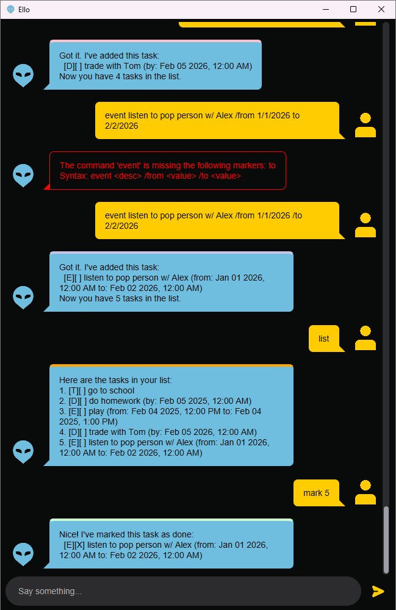

# Ello User Guide



Ello is a task management chatbot to help you organize your tasks efficiently. Whether you're a student,
professional, with Ello, you can easily add, view, and manage your tasks using simple commands.

## Quick Start

1. Ensure you have Java 17 or above installed.
2. Download the latest `.jar` file from [here](https://github.com/dinhcodes/ip/releases).
3. Copy the file to an empty folder.
4. Open a terminal, navigate `cd` to the folder, and run:
   ```bash
   java -jar ello.jar
    ```

## Features

### Adding a Todo Task: `todo`

Add a simple task to your list.

**Format:** `todo <description>`

**Example:**

```
todo Watch CS2103T briefing
```

**Expected output:**

```
Got it. I've added this task:
  [T][ ] Watch CS2103T briefing
Now you have 1 Task in the list.
```

---

### Adding a Deadline: `deadline`

Add a task with a specific deadline.

**Format:** `deadline <description> /by <date_time>`

**Date-time formats supported:**

- `d/M/yyyy HH:mm` (e.g., 20/2/2026 16:00)
- `dd/MM/yyyy HH:mm` (e.g., 20/02/2026 16:00)
- `yyyy-MM-dd HH:mm` (e.g., 2026-02-20 16:00)
- Date-only formats (time defaults to start of day):
- `d/M/yyyy` (e.g., 20/2/2026)
- `dd/MM/yyyy` (e.g., 20/02/2026)
- `yyyy-MM-dd` (e.g., 2026-02-20)

**Example:**

```
deadline Submit CS2103T IP /by 20/2/2026 16:00
```

**Expected output:**

```
Got it. I've added this task:
  [D][ ] Submit CS2103T IP (by: Feb 20 2026, 4:00 PM)
Now you have 2 tasks in the list.
```

---

### Adding an Event: `event`

Add a task that starts and ends at specific times.

**Format:** `event <description> /from <value> /to <value>`

**Example:**

```
event Team meeting /from 19/2/2026 21:30 /to 19/2/2026 22:30
```

**Expected output:**

```
Got it. I've added this task:
  [E][ ] Team meeting (from: Feb 19 2026, 9:30 PM to: Feb 19 2026, 10:30 PM)
Now you have 3 tasks in the list.
```

---

### Viewing All Tasks: `list`

Display all tasks in your list.

**Format:** `list`

**Example:**

```
list
```

**Expected output:**

```
Here are the tasks in your list:
1. [T][ ] Watch CS2103T briefing
2. [D][ ] Submit CS2103T IP (by: Feb 20 2026, 4:00 PM)
3. [E][ ] Team meeting (from: Feb 19 2026, 9:30 PM to: Feb 19 2026, 10:30 PM)
```

---

### Marking Tasks as Done: `mark`

Mark a task as completed.

**Format:** `mark <task_number>`

**Example:**

```
mark 1
```

**Expected output:**

```
Nice! I've marked this task as done:
  [T][X] Watch CS2103T briefing
```

---

### Unmarking Tasks: `unmark`

Mark a completed task as not done.

**Format:** `unmark <task_number>`

**Example:**

```
unmark 1
```

**Expected output:**

```
OK, I've marked this task as not done yet:
  [T][ ] Watch CS2103T briefing
```

---

### Deleting Tasks: `delete`

Remove a task from your list.

**Format:** `delete <task_number>`

**Example:**

```
delete 2
```

**Expected output:**

```
Deleted Task
[D][ ] Submit CS2103T IP (by: Feb 20 2026, 4:00 PM)
Now you have 2 tasks in the list.
```

---

### Finding Tasks: `find`

Search for tasks containing specific keywords.

**Format:** `find <keyword>`

**Example:**

```
find meeting
```

**Expected output:**

```
Here are the matching tasks in your list:
1. [E][ ] Team meeting (from: Feb 19 2026, 9:30 PM to: Feb 19 2026, 10:30 PM)
```

---

### Getting Help: `help`

View a list of all available commands.

**Format:** `help`

**Example:**

```
help
```

**Expected output:**

```
Available commands:

1. todo: Adds a todo task to the list
2. deadline: Adds a deadline task to the list
3. event: Adds an event task to the list
4. list: Lists all tasks
5. mark: Marks a task as done
6. unmark: Marks a task as not done
7. delete: Deletes a task from the list
8. find: Finds tasks containing the specified keyword
9. bye: Exits the application


Type 'help <number>' to see detailed syntax for each command.
```

---

### Getting Detailed Help: `help <number>`

View detailed syntax for a specific command.

**Format:** `help <command_number>`

**Example:**

```
help 2
```

**Expected output:**

```
deadline: Syntax: deadline <desc> /by <value>
```

---

### Exiting the Application: `bye`

Close Ello and save your tasks.

**Format:** `bye`

**Example:**

```
bye
```

**Expected output:**

```
Bye. Hope to see you again soon!
```

You would also expect the application to close after this command, and all your tasks to be saved for the next time you
open Ello.

---

## Command Summary

| Command                                         | Description                                  |
|-------------------------------------------------|----------------------------------------------|
| `todo <description>`                            | Adds a todo task to the list                 |
| `deadline <description> /by <value>`            | Adds a deadline task to the list             |
| `event <description> /from <value> /to <value>` | Adds an event task to the list               |
| `list`                                          | Lists all tasks                              |
| `mark <task_number>`                            | Marks a task as done                         |
| `unmark <task_number>`                          | Marks a task as not done                     |
| `delete <task_number>`                          | Deletes a task from the list                 |
| `find <keyword>`                                | Finds tasks containing the specified keyword |
| `help`                                          | Lists all available commands                 |
| `help <command_number>`                         | Shows detailed syntax for a specific command |
| `bye`                                           | Exits the application & Closes the window    |

---

## Acknowledgements

This project uses JavaFX for the graphical user interface and Gson for JSON serialization. Artificial Intelligence (AI)
has been used to assist in this project: help to write JavaDoc comments, CSS styling, code refactoring, and
architectural design decisions.

This README.md is based on the original README.md provided by the CS2103T teaching team, and that
by [JamieLoh](https://github.com/JamieLoh/ip/blob/master/docs/README.md).